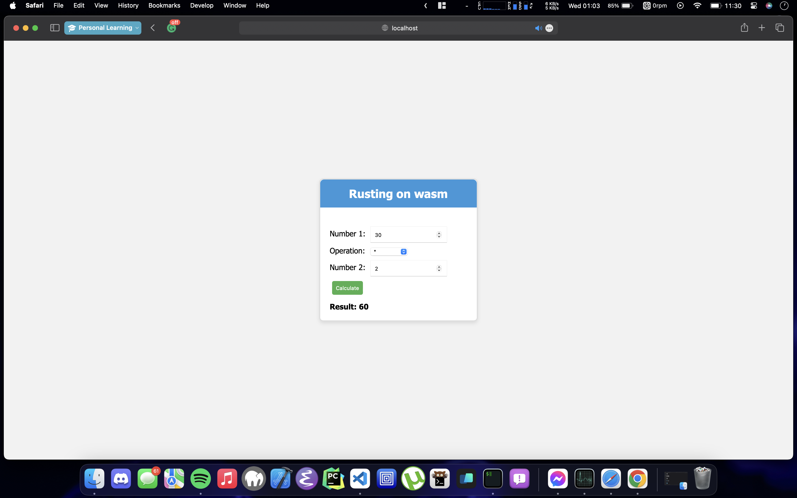

# wasm-meets-rust

This project demonstrates a simple calculator implemented in Rust and compiled to WebAssembly, allowing it to be used in a web browser.

## Directory Structure

```plaintext
wasm-meets-rust-calc
│
├── Cargo.lock
├── Cargo.toml
├── index.html
├── index.js
├── pkg
│   ├── package.json
│   ├── wasm_meets_rust.d.ts
│   ├── wasm_meets_rust.js
│   ├── wasm_meets_rust_bg.wasm
│   └── wasm_meets_rust_bg.wasm.d.ts
├── src
│   └── lib.rs
├── styles.css
└── target
    └── (build artifacts)
```

# Installation and Running

## Prerequisites

Ensure you have Rust installed. You can install Rust on macOS using either:

### Option 1: Using the official Rust installer

```bash
curl --proto '=https' --tlsv1.2 -sSf https://sh.rustup.rs | sh
```

Follow the instructions to complete the installation.

### Option 2: Using Homebrew

```
brew install rust
```

Use rustup to install the Rust compiler (rustc) and the Rust package manager (cargo).

```
rustup-init
```

To verify you can run:

```
rustc --version
```

## Setting up the Project

Clone the repository

```
git clone https://github.com/bibitchhetri/wasm-meets-rust-calc.git
```

#### Jump to the build section below for more info

### Create a new Rust project:

```
cargo init wasm-meets-rust
```

### Change into the project directory:

```
cd wasm-meets-rust
```

### Update Cargo.toml with the following:

[package]

```
name = "wasm-meets-rust"
version = "0.1.0"
authors = ["kunwar.bibit7@gmail.com"]
edition = "2021"

[lib]
crate-type = ["cdylib"]

[dependencies]
wasm-bindgen = "0.2"
```

Create the src/lib.rs file with the provided Rust code.
Create the index.html, index.js, and styles.css files with the provided content.
Building and Running
Install wasm-pack:

```
cargo install wasm-pack
```

### Build the project:

```
wasm-pack build --target web
```

### Serve the project using an HTTP server. You can use Python's built-in server:

```
python3 -m http.server
```

Open your web browser and navigate to http://localhost:8000. You should see the Rusting on wasm Calculator.

### Usage

Enter numeric values for "Number 1" and "Number 2".
Choose an operation from the dropdown menu.
Click the "Calculate" button to see the result.

### Preview



### License

This project is licensed under the GPL-3.0 License - see the [License](LICENSE) file for details.
